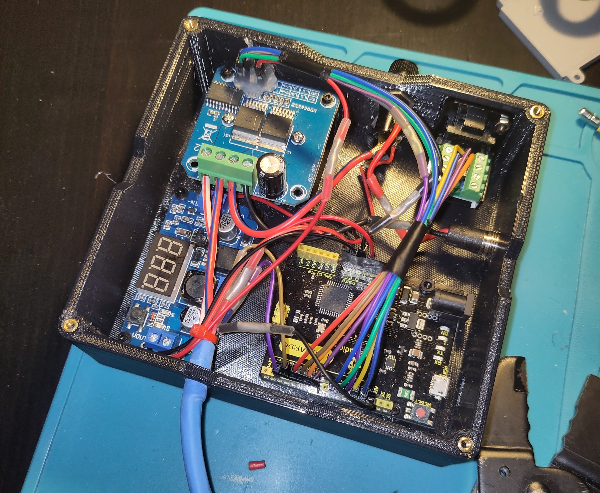
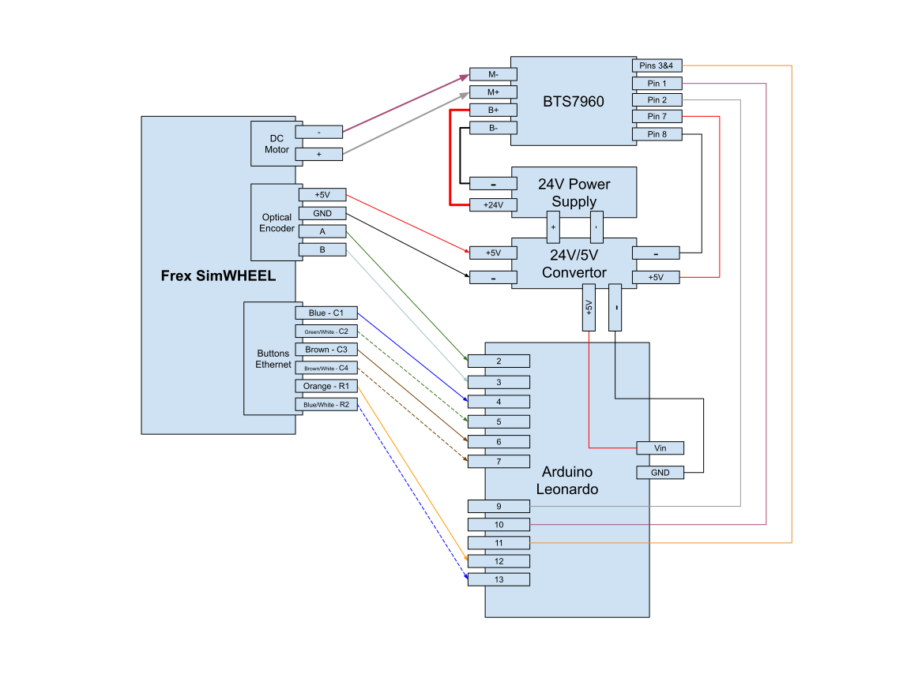

## FrexDuino SimWheel Controller

### About this project

FrexDuino has been specifically developed to support the [Frex SimWHEEL (v1)](https://www.youtube.com/watch?v=tcqOE-FSnFI). The Frex was originally delivered with an Immersion FFB controller. This controller works fine, but only with 32bit games. Many 64bit games (Asseto Corsa, Automobilista 2, Dirt 2) crash when using the Immersion driver.

An Arduino Leonardo running the FrexDuino firmware will be recognized by Windows as a generic input device with force feedback capabilities. This solves the Immersion driver issue by simply not using that driver.

The FrexDuino project is meant to be a complete replacement for the Immersion controller box. In order to get the Frex wheel working with FrexDuino, you will need:

 - the firmware in this project
 - an [Arduino Leonardo](https://amzn.to/4huuYeO) board to run the firmware
 - a [BTS7960 motor controller](https://amzn.to/4jzXH3w) to drive the wheel's DC motor
 - a [power converter](https://amzn.to/3EcqdIw) to convert from 24V to 5V
 - a [power supply](https://amzn.to/4jzXH3w) to power everything up
 - fuses, wires, project box & a bit of DYI skills to put it all together

#### Example of finished product

When it all goes well, you will have a box which connects to the Frex wheel (using the original encoder, motor & button cables). The box will also provide a micro-USB port for connecting to your PC.



### Frex SimWHEEL: what works / doesn't

- **Works**: wheel position, force feedback, and 8 wheel buttons. 
- **Doesn't**: H-shifter, sequential shifter, hand brake, pedals, LED.

I own the simplest Frex wheel, with only 8 buttons on the wheel adapter (including the 2 paddle shifters). And I have no other shifters or pedals connected to my Frex wheel controller. So far I only implemented the Frex SimWHEEL connections I could test with my own wheel:

 - optical encoder to keep track of the position
 - DC motor +/- to send the actual FFB signal
 - ethernet cable supporting the button matrix

As you can see, the basics are all there: position, force feedback and wheel buttons. I intentionally left the wheel LED unconnected for now. 

There are enough inputs left on the Arduino to add support for Frex pedals and/or shifters that were originally delivered with the wheel - PRs for any of these are welcome.

### Building & uploading the firmware

 - this project requires [PlatformIO](https://platformio.org/platformio-ide). Download and install the PlatformIO IDE. I use the VSCode extension, it works great.
 - clone this GitHub repository. No other dependencies are needed. 
 - open the cloned repository folder as a project in the PlatformIO context (make sure you do it from the PlatformIO Home). You can now build the project and upload it to your Arduino Leonardo board. 

### Wiring diagram



The above diagram shows the basic wiring sketch for controlling the Frex SimWHEEL. There are no fuses drawn, but it is a good idea to add at least one. I used two fuses for my FrexDuino, one for the 5V components, and another for the 24V ones (2 amps and 5 amps, respectively). 

Note that the Frex connections drawn represent the actual cables coming from the wheel (and **not** the Immersion box). You should have at least 3 cables coming out the back of your wheel:

- the thicker black & white pair connected to the DC motor
- the thinner 4 wire cable connected to the optical encoder 
- the ethernet cable connected to the wheel adapter (buttons & LED)

#### Arduino Pins

All pins used for the Arduino are the digital ones. The pins connecting the optical encoder (2 & 3) and motor controller (9 & 10) are linked to timers & interrupts in the code. They cannot be changed without complex code changes. 

The pins for the button matrix can be changed by adjusting the constants defined in the [code](src/constants.h). 

#### BTS7960 motor controller & DC Motor 

**Important!** Make sure that the `B+/-` connections of the BTS7960 motor controller are going to the correct polarities of your power supply. Using a fuse here is a good idea. 

On the other hand, you don't need to worry which side is `+` and which is `-` for your wheel's DC motor (`M+/-` connections on the BTS7960). The motor can spin both ways, while the direction of the FFB can be adjusted by swapping pin connections 9 & 10 on the Arduino.

#### Optical Encoder 

It's important to get the optical encoder's `5V` and `GND` wires right. Mine were obvious, red and black, respectively. Google the part number on your optical encoder to make sure.

If turning the wheel is moving the axis in the wrong direction, swap pin connections 2 & 3 on the Arduino.

#### Button Matrix

Frex uses an ethernet cable to connect the button matrix. The colors mentioned in the diagram are for the **ethernet wires**. R1 & R2 are row pins, while C1, C2... are column ones. 

As each wheel was hand-made, yours might be wired differently than mine. You can find out which wire is which for your wheel by tracing the connections for each button, and following one simple rule:

 - every button is **always** connected to precisely one row and one column.

It's not a problem if you switch the row pins around. You can also switch the columns around. But it is important to not switch a row pin with a column pin. 

The green wire on the ethernet cable is unused for my wheel. It could be used as a third row pin to wire up more buttons (if you have the fancier wheel adapter). 

Frex uses the orange wire to also wire up the LED, together with the Orange/White wire (which is not used for the buttons). I left the LED unconnected, as previously mentioned.

### Wheel rotation parameters 

There are two important wheel parameters defined in [code](src/constants.h).

#### 1. Encoder pulses per revolution (PPR)

You need to configure the constant `ENCODER_PPR` to match your optical encoder. My wheel came with the optical encoder `RE12D-300-201-1`. A quick search the part number reveals the CPR for this optical encoder to be 300. Most encoders apply a formula of `PPR=CPR*4`, so in my case `ENCODER_PPR=1200` 

#### 2. Wheel total rotation degrees

Frex came with adjustable hard stops for limiting the rotation. The `WHEEL_TOTAL_DEGREES` constant should be set to the number of degrees the Frex wheel can move between these hard stops (1 full wheel rotation = 360 degrees). 

**Note:** it is not needed (or recommended) to modify this number after setting it the first time, unless the wheel's hard stops are actually adjusted as well. If you need to virtually limit the rotation of your wheel to accommodate an older game, you should use [DXTweak2](https://www.xsimulator.net/community/marketplace/dxtweak2-change-calibration-and-deadzone-settings-of-a-directinput-game-controller.245/). FrexDuino will work fine with whatever limits you set in DXTweak2.

### Centering the wheel

After plugging your FrexDuino in, manually center the steering wheel. Afterward long-press `Button 1` to reset the axis to center. You can see which button is `1` in Windows's "USB Controllers" application. The button that triggers the centering as well as the long-press threshold can be configured in [code](src/constants.h).

### Adjusting the FFB gain

**Warning!** The Frex gearing can generate a lot of torque at the wheel. By default, FrexDuino's FFB gain (strength) is set to 25%. This can already feel quite strong, so test with care the first time you plug the wheel in.

A simple [open-source](https://github.com/bogdan-dumitrescu/frexduino-console) tool is included in the `utils` folder of this project. It allows you to adjust FrexDuino's FFB gain without having to recompile the firmware. The gain adjustment tool requires Java to be installed on your system (version 8 or higher). Once Java is installed, you can adjust the gain by opening a command prompt in the directory of this project and running:

```
java -jar utils/frexduino-console.jar 20
```

The above command will attempt to find the FrexDuino device currently connected and adjust its FFB gain to 20%.

### FAQ

**Q: Does this actually work?**

**A:** Yes, most definitely. So far I have tested a FrexDuino box with GT Legends, GTR2, Automobilista 2, and iRacing. All work fine and provide the expected force feedback. Looking forward to hearing your feedback as well!

**Q: Will it burn my precious Frex / encoder / house down?**

**A:** This project requires electronics knowledge, and I am not responsible for any damage directly or indirectly caused by using FrexDuino.

**Q: Why the Arduino Leonardo? Can I use a Uno?**

**A:** The Leonardo has a feature that allows it to be recognized as a USB device. The original Uno will not work for this purpose. Some other boards should work (the Arduino Micro, for example). But I have only tested this project with the Arduino Leonardo.

**Q: Can I use this firmware / wiring diagram for any other wheel than Frex?**

**A:** Although FrexDuino has been specifically developed with the Frex SimWHEEL in mind, FFB wheels are quite similar to each other. If your wheel uses a single motor & an optical encoder, you should be easily able to adapt the firmware to work in your situation. Keep in mind though that the Frex uses a simple button matrix wiring for registering the button presses. Other wheels might use a more complex system (like a shift register).

### Credits & appreciation

This project uses the excelent [ArduinoJoystickWithFFB](https://github.com/YukMingLaw/ArduinoJoystickWithFFBLibrary) library, and draws inspiration from [Arduino-FFB-wheel](https://github.com/ranenbg/Arduino-FFB-wheel). None of this could have been possible without the amazing work done over the past decade in [many](https://github.com/fernandoigor/BRWheel/tree/alphatest) [other](https://github.com/MHeironimus/ArduinoJoystickLibrary) [projects](https://github.com/hoantv/VNWheel).
